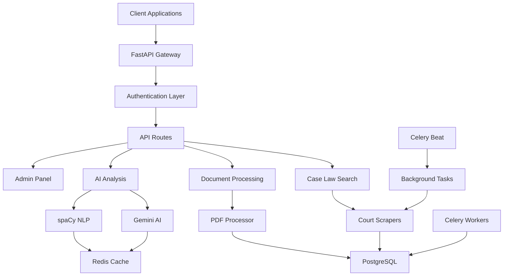

# 🇧🇷 mais petiçoes - AI-Powered Brazilian Legal Research Platform

[](https://fastapi.tiangolo.com)
[](https://python.org)
[](https://postgresql.org)
[](https://redis.io)
[](https://docker.com)

> **Revolutionary AI-powered legal research platform specifically designed for Brazilian law.** Harness the power of machine learning to analyze case law, process legal documents, and generate comprehensive legal research reports.

## 🚀 Features

### 🤖 **AI-Powered Legal Analysis**
- **Advanced NLP Processing** with spaCy Portuguese models
- **Grammar Correction & Rewriting** using LanguageTool + Gemini AI
- **Legal Argument Enhancement** tailored for Brazilian legal standards
- **Intelligent Case Law Analysis** with precedent identification

### 📚 **Comprehensive Case Law Database**
- **Multi-Court Integration**: STF, STJ, TJ-SP, TJ-RJ, and more
- **JusBrasil API Integration** for extensive case law access
- **DJE (Diário da Justiça Eletrônico)** automated scraping
- **Weekly Automated Updates** to maintain current legal database

### 🔍 **Advanced Search & Research**
- **Semantic Search** across millions of Brazilian court decisions
- **Similarity Analysis** to find related cases and precedents
- **Advanced Filtering**: by court, date, legal area, judge
- **Citation Network Analysis** to map legal precedent relationships

### 📄 **Document Processing**
- **PDF Legal Document Analysis** with text extraction
- **Automated Legal Brief Generation**
- **Contract Analysis & Risk Assessment**
- **Legal Opinion Drafting Assistance**

### ⚡ **Production-Ready Infrastructure**
- **Async FastAPI Backend** for high-performance API responses
- **PostgreSQL Database** with optimized legal data models
- **Redis Caching** for lightning-fast search results
- **Celery Background Tasks** for heavy processing workloads
- **Docker Containerization** for seamless deployment

## 🏗️ Architecture



## 🛠️ Tech Stack

| Component | Technology | Purpose |
|-----------|------------|---------|
| **Backend Framework** | FastAPI | High-performance async API |
| **Database** | PostgreSQL | Structured legal data storage |
| **Cache** | Redis | Fast search result caching |
| **Task Queue** | Celery | Background processing |
| **AI/ML** | Google Gemini + spaCy | Legal text analysis |
| **Web Scraping** | BeautifulSoup + httpx | Court data extraction |
| **Containerization** | Docker + Docker Compose | Deployment orchestration |

## 🚀 Quick Start

### Prerequisites
- Docker & Docker Compose
- Python 3.8+
- Git

### Installation

1. **Clone the repository**
   ```bash
   git clone https://github.com/sammadaan/BrazilLawyer.git
   cd BrazilLawyer
   ```

2. **Configure environment variables**
   ```bash
   cp .env.example .env
   # Edit .env with your API keys:
   # - GEMINI_API_KEY (Get from Google AI Studio)
   # - Database credentials
   # - Redis configuration
   ```

3. **Start the complete system**
   ```bash
   docker-compose up --build
   ```

4. **Initialize the database**
   ```bash
   python scripts/init_db.py
   ```

5. **Access the application**
   - API Documentation: http://localhost:8000/docs
   - Interactive API: http://localhost:8000/redoc

## 📖 API Documentation

### Core Endpoints

#### 🔍 **Legal Analysis**
```http
POST /ai-rewrite
Content-Type: application/json

{
  "text": "Texto legal para reescrever",
  "context": "petição inicial"
}
```

#### 📚 **Case Law Search**
```http
POST /api/v1/cases/search
Content-Type: application/json

{
  "query": "direito do consumidor",
  "court": "STJ",
  "date_range": {
    "start": "2023-01-01",
    "end": "2024-01-01"
  },
  "limit": 20
}
```

#### 📄 **Document Analysis**
```http
POST /api/v1/documents/analyze
Content-Type: multipart/form-data

file: [Legal PDF Document]
analysis_type: "contract_review"
```

#### 🎯 **Similar Cases**
```http
POST /api/v1/cases/similar
Content-Type: application/json

{
  "case_text": "Texto do caso para encontrar similares",
  "similarity_threshold": 0.8
}
```

### Advanced Features

#### 📊 **Legal Research Reports**
```http
POST /api/v1/reports/generate
Content-Type: application/json

{
  "topic": "Direito do Trabalho - Horas Extras",
  "courts": ["TST", "TRT"],
  "analysis_depth": "comprehensive"
}
```

## 🗂️ Project Structure

```
BrazilLawyer/
├── 📁 app/
│   ├── 📁 database/          # Database models & schemas
│   ├── 📁 routers/           # API route definitions
│   ├── 📁 services/          # Business logic & scrapers
│   ├── 📁 scrapers/          # Court-specific scrapers
│   ├── 📁 tasks/             # Background task definitions
│   ├── 📁 utils/             # Utility functions
│   └── 📄 main.py           # FastAPI application entry
├── 📁 config/                # Configuration management
├── 📁 scripts/               # Database & deployment scripts
├── 📁 tests/                 # Comprehensive test suite
├── 📄 docker-compose.yml    # Multi-service orchestration
├── 📄 requirements.txt      # Python dependencies
└── 📄 README.md             # This file
```

## 🤝 Contributing

We welcome contributions to make BrazilLawyer even better! 

### Development Setup

1. **Fork & clone the repository**
2. **Create a virtual environment**
   ```bash
   python -m venv venv
   source venv/bin/activate  # Linux/Mac
   venv\Scripts\activate     # Windows
   ```
3. **Install dependencies**
   ```bash
   pip install -r requirements.txt
   ```
4. **Run tests**
   ```bash
   pytest tests/
   ```

### Areas for Contribution
- 🏛️ **Additional Court Scrapers** (TRF, TRT, etc.)
- 🧠 **AI Model Fine-tuning** for Brazilian legal text
- 🔍 **Advanced Search Algorithms**
- 📊 **Legal Analytics Dashboard**
- 🌐 **API Rate Limiting & Security**
- 📱 **Mobile API Optimizations**

## 📊 Usage Examples

### Example 1: Grammar Correction
```python
import requests

response = requests.post("http://localhost:8000/grammar-correct", 
    json={"text": "O contrato deve ser assinado pelas parte envolvidas"})
print(response.json()["corrected_text"])
# Output: "O contrato deve ser assinado pelas partes envolvidas"
```

### Example 2: Case Law Research
```python
response = requests.post("http://localhost:8000/api/v1/cases/search",
    json={
        "query": "dano moral consumidor",
        "court": "STJ",
        "limit": 5
    })
for case in response.json()["cases"]:
    print(f"Case: {case['title']}")
    print(f"Court: {case['court']}")
    print(f"Summary: {case['summary'][:200]}...")
```

## 🔒 Security & Compliance

- **LGPD Compliant** data handling procedures
- **Secure API Authentication** with JWT tokens
- **Rate Limiting** to prevent API abuse
- **Data Encryption** for sensitive legal information
- **Audit Logging** for all legal research activities

## 📈 Performance

- **Sub-second search** across millions of legal documents
- **Concurrent processing** of multiple legal analyses
- **Horizontal scaling** support with Redis clustering
- **Optimized database queries** with proper indexing
- **Cached results** for frequently accessed precedents

## 🎯 Roadmap

### Q1 2025
- [ ] Mobile-responsive web interface
- [ ] Real-time legal news integration
- [ ] Advanced citation analysis
- [ ] Legal document templates

### Q2 2025
- [ ] Machine learning model fine-tuning
- [ ] Integration with major legal databases
- [ ] Multi-language support (Spanish, English)
- [ ] Legal workflow automation

### Q3 2025
- [ ] AI-powered legal brief writing
- [ ] Predictive case outcome analysis
- [ ] Client portal integration
- [ ] Advanced reporting dashboards

## 📞 Support & Community

- **Documentation**: [Full API Documentation](http://localhost:8000/docs)
- **Issues**: [GitHub Issues](https://github.com/sammadaan/BrazilLawyer/issues)
- **Discussions**: [GitHub Discussions](https://github.com/sammadaan/BrazilLawyer/discussions)
- **Email**: aseemmadaan9@gmail.com

## 📜 License

This project is licensed under the MIT License - see the [LICENSE](LICENSE) file for details.

## 🙏 Acknowledgments

- **spaCy Team** for excellent Portuguese NLP models
- **FastAPI Community** for the amazing web framework
- **Brazilian Legal Community** for inspiration and feedback
- **Open Source Contributors** who make projects like this possible

---

<div align="center">

**⚖️ Built with ❤️ for the Brazilian Legal Community ⚖️**

*Empowering lawyers, students, and legal professionals with AI-driven research tools*

[](https://github.com/sammadaan/BrazilLawyer)
[](https://github.com/sammadaan/BrazilLawyer/fork)

</div>
